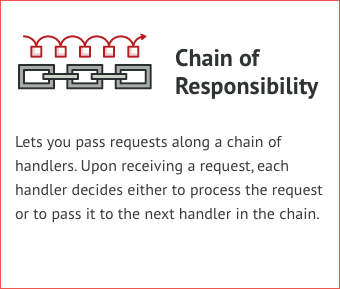
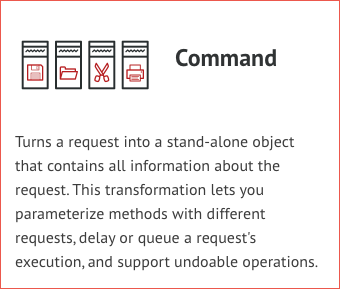
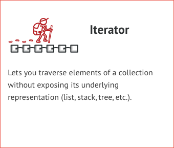
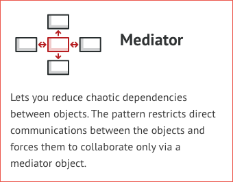
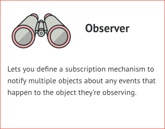
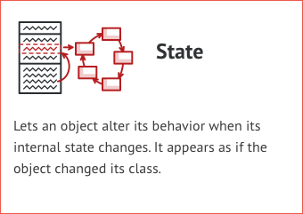
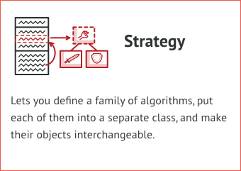
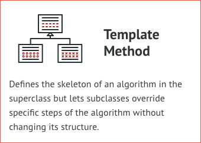
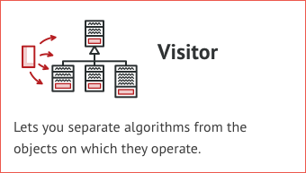

# Behavioural Design Patterns
Behavioral design patterns are concerned with algorithms and the assignment of responsibilities between objects.

# Patterns
### 1. Chain of Responsibility

### 2. Command

### 3. Iterator

### 4. Mediator

### 5. Memento

### 6. Observer

### 7. State

### 8. Strategy

### 9. Template Method

### 10. Visitor

## Rules of thumb
