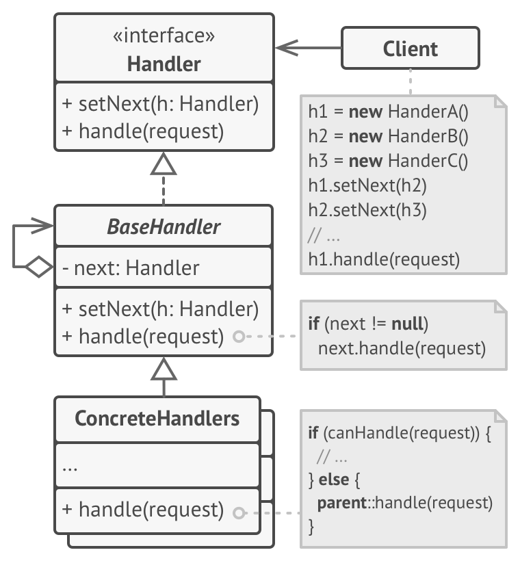
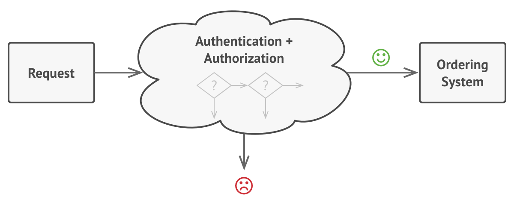
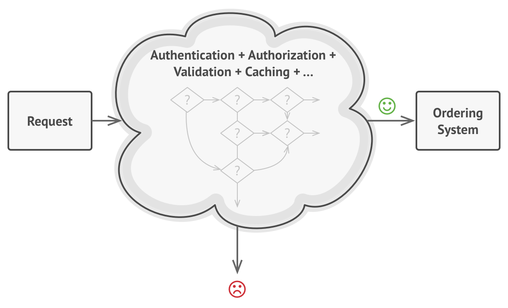
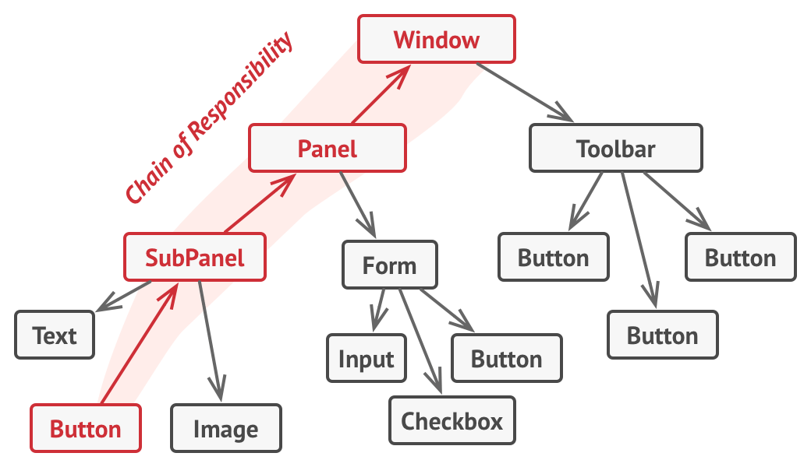

## Chain of Responsibility Pattern
Chain of Responsibility is a behavioral design pattern that lets you pass requests along a chain of handlers. 
Upon receiving a request, each handler decides either to process the request or to pass it to the next handler in the 
chain.

## Structure

## Problem
Imagine that you’re working on an online ordering system. You want to restrict access to the system so only 
authenticated users can create orders. Also, users who have administrative permissions must have full access to all 
orders.

After a bit of planning, you realized that these checks must be performed sequentially. 
The application can attempt to authenticate a user to the system whenever it receives a request that contains the user’s 
credentials. However, if those credentials aren’t correct and authentication fails, there’s no reason to proceed with 
any other checks.

During the next few months, you implemented several more of those sequential checks.

- One of your colleagues suggested that it’s unsafe to pass raw data straight to the ordering system. So you added an
 extra validation step to sanitize the data in a request.

- Later, somebody noticed that the system is vulnerable to brute force password cracking. To negate this, you promptly
 added a check that filters repeated failed requests coming from the same IP address.

- Someone else suggested that you could speed up the system by returning cached results on repeated requests
 containing the same data. Hence, you added another check which lets the request pass through to the system only if 
 there’s no suitable cached response.
 

The code of the checks, which had already looked like a mess, became more and more bloated as you added each 
new feature. Changing one check sometimes affected the others. Worst of all, when you tried to reuse the checks to 
protect other components of the system, you had to duplicate some of the code since those components required some of 
the checks, but not all of them.

The system became very hard to comprehend and expensive to maintain. You struggled with the code for a while, until 
one day you decided to refactor the whole thing.

## Solution
Like many other behavioral design patterns, the `Chain of Responsibility` relies on transforming particular behaviors 
into stand-alone objects called handlers. 
In our case, each check should be extracted to its own class with a single method that performs the check. 
The request, along with its data, is passed to this method as an argument.

The pattern suggests that you link these handlers into a chain. 
Each linked handler has a field for storing a reference to the next handler in the chain. 
In addition to processing a request, handlers pass the request further along the chain. 
The request travels along the chain until all handlers have had a chance to process it.

Here’s the best part: a handler can decide not to pass the request further down the chain and effectively stop any 
further processing.

In our example with ordering systems, a handler performs the processing and then decides whether to pass the request 
further down the chain. Assuming the request contains the right data, all the handlers can execute their primary 
behavior, whether it’s authentication checks or caching.

However, there’s a slightly different approach (and it’s a bit more canonical) in which, upon receiving a request, 
a handler decides whether it can process it. If it can, it doesn’t pass the request any further. 
So it’s either only one handler that processes the request or none at all. 
This approach is very common when dealing with events in stacks of elements within a graphical user interface.

For instance, when a user clicks a button, the event propagates through the chain of GUI elements that starts with the 
button, goes along its containers (like forms or panels), and ends up with the main application window. 
The event is processed by the first element in the chain that’s capable of handling it. 
This example is also noteworthy because it shows that a chain can always be extracted from an object tree.

It’s crucial that all handler classes implement the same interface. 
Each concrete handler should only care about the following one having the `execute` method. 
This way you can compose chains at runtime, using various handlers without coupling your code to their concrete classes.

## Participants
- `Handler`: Abstract base class acting as the interface to handle request. Optionally, but most
 often the Handler implements the chain links.

- `ConcreteHandler`: Handles request, else passes it to the next successor of the handler chain

- `Client`: Initiates a request that one of the chain of handlers ( a ConcreteHandler) handles

## When to use this pattern
- When your program is expected to process different kinds of requests in various ways, but the exact types of requests 
and their sequences are unknown beforehand.
- When it’s essential to execute several handlers in a particular order.
- When the set of handlers and their order are supposed to change at runtime.

