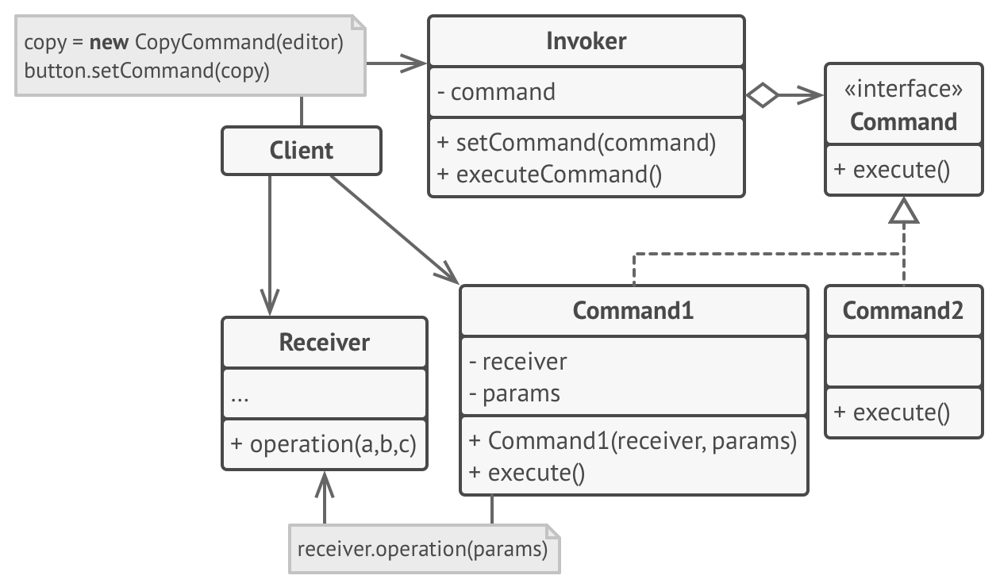
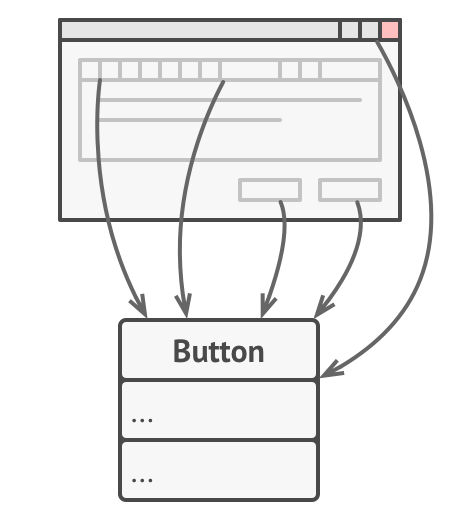
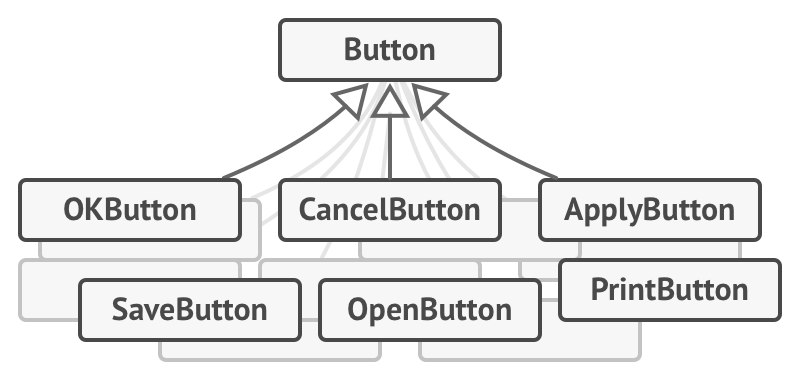
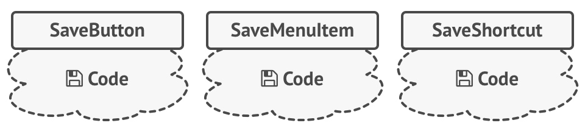
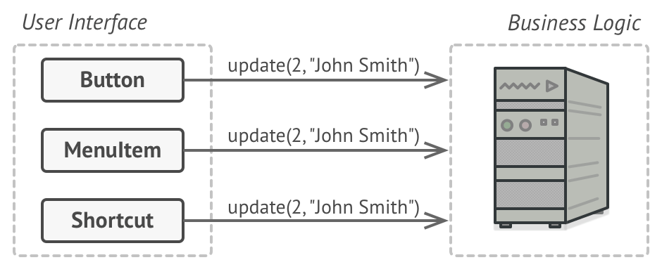
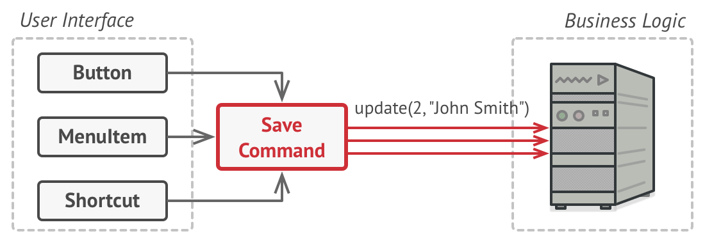
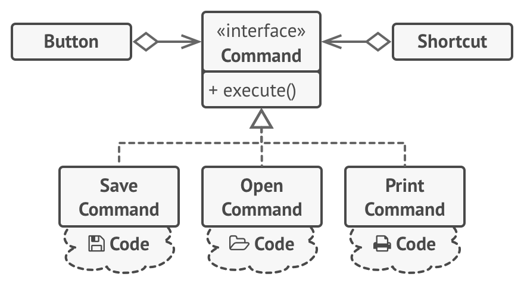

## Command Pattern
Command is a behavioral design pattern that turns a request into a stand-alone object that contains all information 
about the request. This transformation lets you parameterize methods with different requests, delay or queue a request’s 
execution, and support undoable operations.

## Structure

## Problem
Imagine that you’re working on a new text-editor app. 
Your current task is to create a toolbar with a bunch of buttons for various operations of the editor. 
You created a very neat `Button` class that can be used for buttons on the toolbar, as well as for generic buttons in 
various dialogs.

While all of these buttons look similar, they’re all supposed to do different things. 
Where would you put the code for the various click handlers of these buttons? 
The simplest solution is to create tons of subclasses for each place where the button is used. 
These subclasses would contain the code that would have to be executed on a button click.

Before long, you realize that this approach is deeply flawed. 
First, you have an enormous number of subclasses, and that would be okay if you weren’t risking breaking the code in 
these subclasses each time you modify the base `Button` class. 
Put simply, your GUI code has become awkwardly dependent on the volatile code of the business logic.

And here’s the ugliest part. 
Some operations, such as copying/pasting text, would need to be invoked from multiple places. 
For example, a user could click a small `“Copy”` button on the toolbar, or copy something via the context menu, or just 
hit `Ctrl+C` on the keyboard.

Initially, when our app only had the toolbar, it was okay to place the implementation of various operations into the 
button subclasses. In other words, having the code for copying text inside the `CopyButton` subclass was fine. 
But then, when you implement context menus, shortcuts, and other stuff, you have to either duplicate the operation’s 
code in many classes or make menus dependent on buttons, which is an even worse option.

## Solution
Good software design is often based on the principle of separation of concerns, which usually results in breaking an 
app into layers. The most common example: a layer for the graphical user interface and another layer for the 
business logic. The GUI layer is responsible for rendering a beautiful picture on the screen, capturing any input and 
showing results of what the user and the app are doing. 
However, when it comes to doing something important, like calculating the trajectory of the moon or composing an annual 
report, the GUI layer delegates the work to the underlying layer of business logic.

In the code it might look like this: a GUI object calls a method of a business logic object, passing it some arguments. 
This process is usually described as one object sending another a request.

The Command pattern suggests that GUI objects shouldn’t send these requests directly. 
Instead, you should extract all of the request details, such as the object being called, the name of the method and 
the list of arguments into a separate command class with a single method that triggers this request.

Command objects serve as links between various GUI and business logic objects. 
From now on, the GUI object doesn’t need to know what business logic object will receive the request and how it’ll be
processed. The GUI object just triggers the command, which handles all the details.

The next step is to make your commands implement the same interface. 
Usually it has just a single execution method that takes no parameters. 
This interface lets you use various commands with the same request sender, without coupling it to concrete classes of 
commands. As a bonus, now you can switch command objects linked to the sender, effectively changing the sender’s 
behavior at runtime.

You might have noticed one missing piece of the puzzle, which is the request parameters. 
A GUI object might have supplied the business-layer object with some parameters. 
Since the command execution method doesn’t have any parameters, how would we pass the request details to the receiver? 
It turns out the command should be either pre-configured with this data, or capable of getting it on its own.

Let’s get back to our text editor. 
After we apply the `Command` pattern, we no longer need all those button subclasses to implement various click behaviors. 
It’s enough to put a single field into the base `Button` class that stores a reference to a command object and make the 
button execute that command on a click.

You’ll implement a bunch of command classes for every possible operation and link them with particular buttons, 
depending on the buttons’ intended behavior.

Other GUI elements, such as menus, shortcuts or entire dialogs, can be implemented in the same way. 
They’ll be linked to a command which gets executed when a user interacts with the GUI element. 
As you’ve probably guessed by now, the elements related to the same operations will be linked to the same commands, 
preventing any code duplication.

As a result, commands become a convenient middle layer that reduces coupling between the GUI and business logic layers. 
And that’s only a fraction of the benefits that the `Command` pattern can offer!

## Participants
- `Command`: Is an interface for executing an action.

- `ConcreteCommand`: Are concrete classes that implements `Command` and defines the `execute()` and `undo()` methods to
 communicate with receivers for performing an action and undoing it respectively.

- `Invoker`(RemoteControl)`: Asks `Command` to carry out the action.

- `Receiver`: Performs the action based on the command it receives.

- `Clien`t: Creates a `ConcreteCommand` object and sets its receiver.

## When to use this pattern
- When you want to parametrize objects with operations.
- When you want to queue operations, schedule their execution, or execute them remotely.
- When you want to implement reversible operations.
