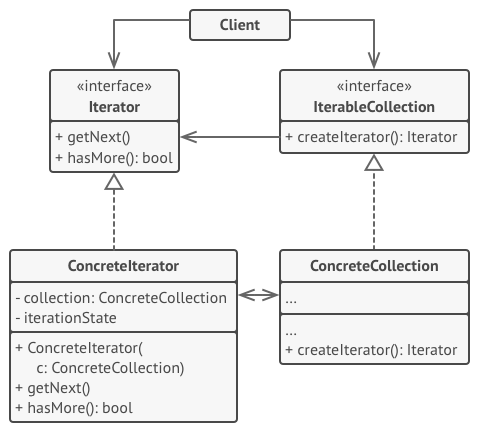
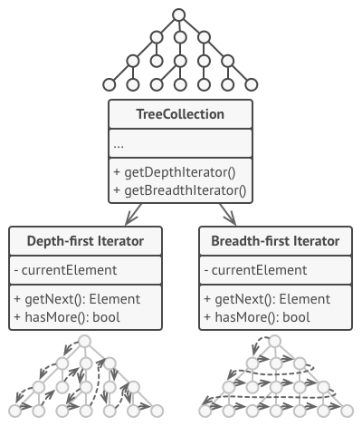

## Iterator Pattern
Iterator is a behavioral design pattern that lets you traverse elements of a collection without exposing its underlying 
representation (list, stack, tree, etc.).

## Structure

## Problem
Collections are one of the most used data types in programming. 
Nonetheless, a collection is just a container for a group of objects.

Most collections store their elements in simple lists. 
However, some of them are based on stacks, trees, graphs and other complex data structures.

But no matter how a collection is structured, it must provide some way of accessing its elements so that other code can 
use these elements. There should be a way to go through each element of the collection without accessing the same 
elements over and over.

This may sound like an easy job if you have a collection based on a list. 
You just loop over all of the elements. 
But how do you sequentially traverse elements of a complex data structure, such as a tree? 
For example, one day you might be just fine with `depth-first` traversal of a tree. 
Yet the next day you might require `breadth-first` traversal. 
And the next week, you might need something else, like random access to the tree elements.

Adding more and more traversal algorithms to the collection gradually blurs its primary responsibility, which is 
efficient data storage. Additionally, some algorithms might be tailored for a specific application, so including them 
into a generic collection class would be weird.

On the other hand, the client code that’s supposed to work with various collections may not even care how they store 
their elements. However, since collections all provide different ways of accessing their elements, you have no option 
other than to couple your code to the specific collection classes.

## Solution
The main idea of the `Iterator` pattern is to extract the traversal behavior of a collection into a separate object 
called an iterator.

In addition to implementing the algorithm itself, an iterator object encapsulates all of the traversal details, 
such as the current position and how many elements are left till the end. 
Because of this, several iterators can go through the same collection at the same time, independently of each other.

Usually, iterators provide one primary method for fetching elements of the collection.
The client can keep running this method until it doesn’t return anything, which means that the iterator has traversed 
all of the elements.

All iterators must implement the same interface. 
This makes the client code compatible with any collection type or any traversal algorithm as long as there’s a proper 
iterator. If you need a special way to traverse a collection, you just create a new iterator class, without having to 
change the collection or the client.

## Participants
- `Aggregate`: Is an interface that declares the methods to create and return an iterator.

- `ConcreteAggregate`: Is a concrete class that implements the Aggregate interface to create and return an iterator.

- `Iterator`: Is an interface with methods to allow clients to access and traverse elements.

- `ConcreteIterator`: Is a concrete class that implements the Iterator interface. Objects of this class keeps track
 of the elements and implements access and traversal operations on the elements.

## When to use this pattern
- When your collection has a complex data structure under the hood, but you want to hide its complexity from clients 
(either for convenience or security reasons).
- When you want to reduce duplication of the traversal code across your app.
- When you want your code to be able to traverse different data structures or when types of these structures are unknown 
beforehand.
