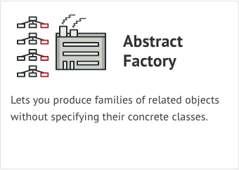
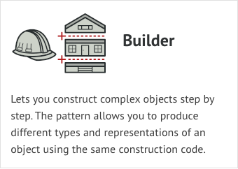
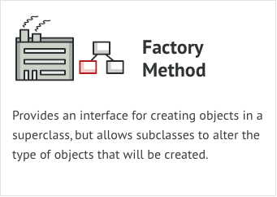
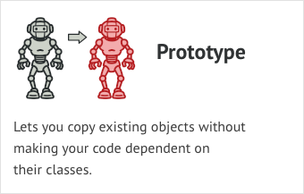

# Creational Design Patterns
Creational patterns provide various object creation mechanisms, which increase flexibility and reuse of existing code.

# Patterns
### 1. Abstract Factory

### 2. Builder

### 3. Factory Method

### 4. Object Pool

### 5. Prototype

### 6. Singleton

## Rules of thumb

- Sometimes creational patterns are competitors: there are cases when either Prototype or Abstract Factory could be
 used profitably. At other times they are complementary: Abstract Factory might store a set of Prototypes from which to clone and return product objects, Builder can use one of the other patterns to implement which components get built. Abstract Factory, Builder, and Prototype can use Singleton in their implementation.

- Abstract Factory, Builder, and Prototype define a factory object that's responsible for knowing and creating the
 class of product objects, and make it a parameter of the system. Abstract Factory has the factory object producing objects of several classes. Builder has the factory object building a complex product incrementally using a correspondingly complex protocol. Prototype has the factory object (aka prototype) building a product by copying a prototype object.

- Abstract Factory classes are often implemented with Factory Methods, but they can also be implemented using Prototype.

- Abstract Factory can be used as an alternative to Facade to hide platform-specific classes.

- Builder focuses on constructing a complex object step by step. Abstract Factory emphasizes a family of product
 objects (either simple or complex). Builder returns the product as a final step, but as far as the Abstract Factory is concerned, the product gets returned immediately.

- Builder is to creation as Strategy is to algorithm.

- Builder often builds a Composite.

- Factory Methods are usually called within Template methods.

- Factory Method: creation through inheritance. Prototype: creation through delegation.

- Often, designs start out using Factory Method (less complicated, more customizable, subclasses proliferate) and
 evolve toward Abstract Factory, Prototype, or Builder (more flexible, more complex) as the designer discovers where more flexibility is needed.

- Prototype doesn't require subclassing, but it does require an Initialize operation. Factory Method requires
 subclassing, but doesn't require Initialize.

- Designs that make heavy use of the Composite and Decorator patterns often can benefit from Prototype as well.
