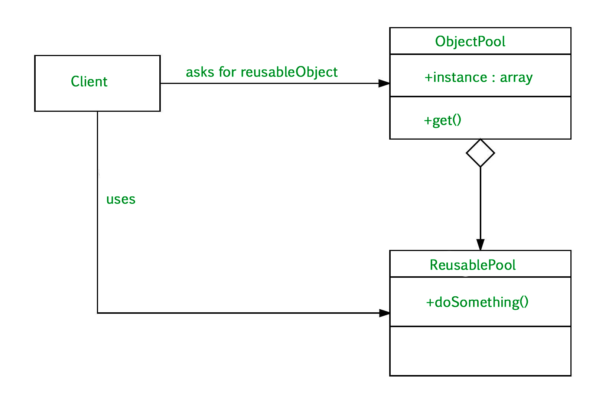

## Object Pool Pattern
Object pool pattern is a software creational design pattern which is used in situations where the cost of initializing a
class instance is very high.

Basically, an `Object` pool is a container which contains some amount of objects. So, when an object is taken from the 
pool, it is not available in the pool until it is put back. Objects in the pool have a lifecycle:

- `Creation`
- `Validation`
- `Destroy`

## Problem
Let’s take the example of the database connections. 
It’s obviously that opening too many connections might affect the performance for several reasons:

- Creating a connection is an expensive operation.
- When there are too many connections opened it takes longer to create a new one and the database server will become
 overloaded.
 
Here the object pool manages the connections and provide a way to reuse and share them. 
It can also limit the maximum number of objects that can be created.

## Participants
- `Client` : This is the class that uses an object of the PooledObject type.
- `ReuseablePool`: The PooledObject class is the type that is expensive or slow to instantiate, or that has limited
availability, so is to be held in the object pool.
- `ObjectPool` : The Pool class is the most important class in the object pool design pattern. ObjectPool maintains a
list of available objects and a collection of objects that have already been requested from the pool.

## When to use factory pattern?
