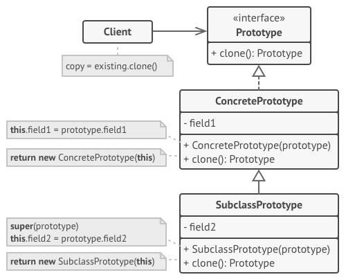
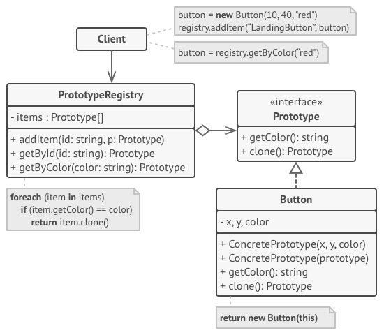

## Prototype Pattern
Prototype is a creational design pattern that lets you copy existing objects without making your code dependent on their
classes.

## Structure

#### A. Basic

#### B. Registry

## Problem
Application "hard wires" the class of object to create in each "new" expression.

## Participants
- `Prototype` : This is the prototype of actual object as discussed above.
- `Prototype registry` : This is used as registry service to have all prototypes accessible using simple string 
parameters.
 - `Client` : Client will be responsible for using registry service to access prototype instances.

## When to use this pattern
The Prototype pattern should be considered when:

- Composition, creation and representation of objects should be decoupled from the system
- Classes to be created are specified at runtime
- You need to hide the complexity of creating new instance from the client
- Creating an object is an expensive operation and it would be more efficient to copy an object.
- Objects are required that are similar to existing objects.

The pattern is used by the Clonable interface in Java. Cloneable is implemented as a marker interface to show what 
objects can be cloned, as Object already defined a protected clone() method. Client can override, or call the superclass
implementation, of this clone method to do the copy.
