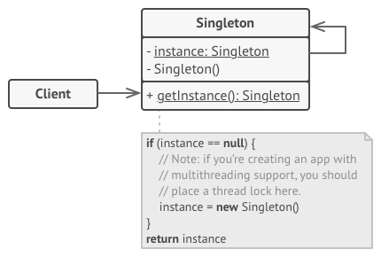

## Singleton Pattern
Singleton is a creational design pattern that lets you ensure that a class has only one instance, while providing a 
global access point to this instance.

Singleton pattern restricts the instantiation of a class and ensures that only one instance of the class exists in the 
java virtual machine. The singleton class must provide a global access point to get the instance of the class. 
Singleton pattern is used for logging, drivers objects, caching and thread pool.

## Structure

## Problem
The Singleton pattern solves two problems at the same time, violating the Single Responsibility Principle:

- Ensure that a class has just a single instance.
- Provide a global access point to that instance.

## Participants
- `Singleton`: class declares the static method getInstance that returns the same instance of its own class.
The Singleton’s constructor should be hidden from the client code. Calling the getInstance method should be the only 
way of getting the Singleton object.

## When to use this pattern
- When a class in your program should have just a single instance available to all clients; 
for example, a single database object shared by different parts of the program.
- When you need stricter control over global variables.

