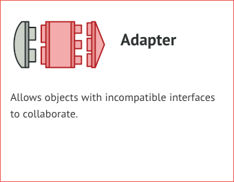
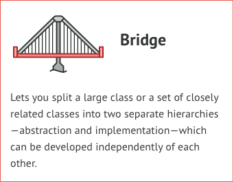
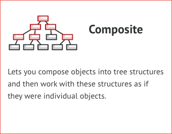
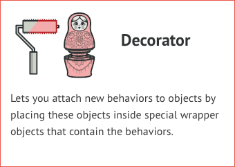
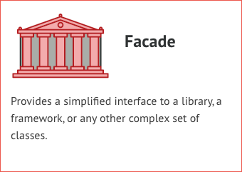
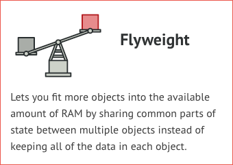

# Structural Design Patterns
In Software Engineering, Structural Design Patterns are Design Patterns that ease the design by identifying a simple way
to realize relationships between entities.

# Patterns
### 1. Adapter

### 2. Bridge

### 3. Composite

### 4. Decorator

### 5. Facade

### 6. Flyweight

### 7. Proxy

## Rules of thumb
- Adapter makes things work after they're designed; Bridge makes them work before they are.

- Bridge is designed up-front to let the abstraction and the implementation vary independently. Adapter is retrofitted
 to make unrelated classes work together.

- Adapter provides a different interface to its subject. Proxy provides the same interface. Decorator provides an
 enhanced interface.

- Adapter changes an object's interface, Decorator enhances an object's responsibilities. Decorator is thus more
 transparent to the client. As a consequence, Decorator supports recursive composition, which isn't possible with pure 
 Adapters.

- Composite and Decorator have similar structure diagrams, reflecting the fact that both rely on recursive composition
 to organize an open-ended number of objects.

- Composite can be traversed with Iterator. Visitor can apply an operation over a Composite. Composite could use Chain
 of responsibility to let components access global properties through their parent. It could also use Decorator to 
 override these properties on parts of the composition. It could use Observer to tie one object structure to another and
 State to let a component change its behavior as its state changes.

- Composite can let you compose a Mediator out of smaller pieces through recursive composition.

- Decorator lets you change the skin of an object. Strategy lets you change the guts.

- Decorator is designed to let you add responsibilities to objects without subclassing. Composite's focus is not on
 embellishment but on representation. These intents are distinct but complementary. Consequently, Composite and 
 Decorator are often used in concert.

- Decorator and Proxy have different purposes but similar structures. Both describe how to provide a level of
 indirection to another object, and the implementations keep a reference to the object to which they forward requests.

- Facade defines a new interface, whereas Adapter reuses an old interface. Remember that Adapter makes two existing
 interfaces work together as opposed to defining an entirely new one.

- Facade objects are often Singleton because only one Facade object is required.

- Mediator is similar to Facade in that it abstracts functionality of existing classes. Mediator abstracts/centralizes
 arbitrary communication between colleague objects, it routinely "adds value", and it is known/referenced by the 
 colleague objects. In contrast, Facade defines a simpler interface to a subsystem, it doesn't add new functionality, 
 and it is not known by the subsystem classes.

- Abstract Factory can be used as an alternative to Facade to hide platform-specific classes.

- Whereas Flyweight shows how to make lots of little objects, Facade shows how to make a single object represent an
 entire subsystem.

- Flyweight is often combined with Composite to implement shared leaf nodes.

- Flyweight explains when and how State objects can be shared.
