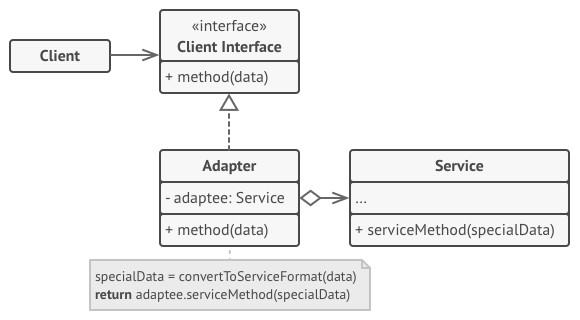
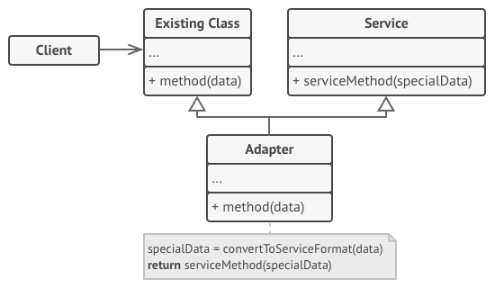

## Adapter Pattern
Adapter is a structural design pattern that allows objects with incompatible interfaces to collaborate.

## Structure
#### A. Object
This implementation uses the object composition principle: the adapter implements the interface of one object and wraps 
the other one. It can be implemented in all popular programming languages.

#### B. Class
This implementation uses inheritance: the adapter inherits interfaces from both objects at the same time. 
Note that this approach can only be implemented in programming languages that support multiple inheritance, such as C++.

## Problem
An "off the shelf" component offers compelling functionality that you would like to reuse, but its "view of the world" 
is not compatible with the philosophy and architecture of the system currently being developed.

## When to use this pattern
- When you want to use some existing class, but its interface isn’t compatible with the rest of your code.
- When you want to reuse several existing subclasses that lack some common functionality that can’t be added to the
 superclass.

