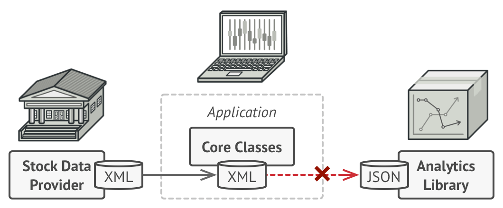
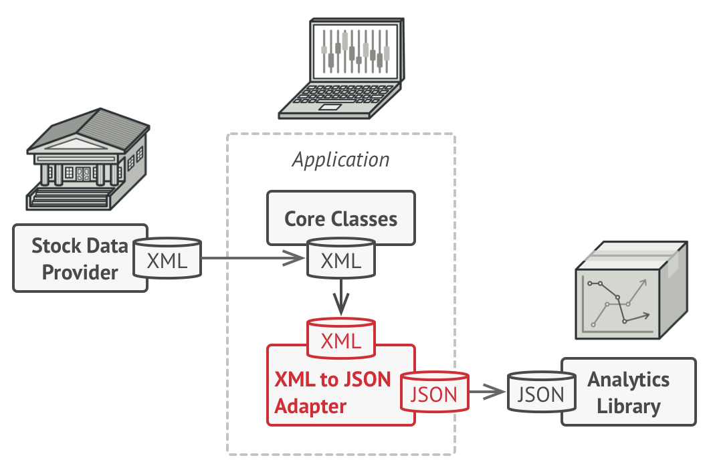

## Adapter Pattern
Adapter is a structural design pattern that allows objects with incompatible interfaces to collaborate.

## Structure
#### A. Object
This implementation uses the object composition principle: the adapter implements the interface of one object and wraps 
the other one. It can be implemented in all popular programming languages.

#### B. Class
This implementation uses inheritance: the adapter inherits interfaces from both objects at the same time. 
Note that this approach can only be implemented in programming languages that support multiple inheritance, such as C++.

## Problem
An "off the shelf" component offers compelling functionality that you would like to reuse, but its "view of the world" 
is not compatible with the philosophy and architecture of the system currently being developed.

Imagine that you’re creating a stock market monitoring app. The app downloads the stock data from multiple sources in 
`XML` format and then displays nice-looking charts and diagrams for the user.

At some point, you decide to improve the app by integrating a smart 3rd-party analytics library. But there’s a catch: 
the analytics library only works with data in `JSON` format.

You could change the library to work with `XML`.
However, this might break some existing code that relies on the library. 
And worse, you might not have access to the library’s source code in the first place, making this approach impossible.

## Solution
You can create an `adapter`. 
This is a special object that converts the interface of one object so that another object can understand it.

An `adapter` wraps one of the objects to hide the complexity of conversion happening behind the scenes. 
The wrapped object isn’t even aware of the `adapter`. 
For example, you can wrap an object that operates in meters and kilometers with an adapter that converts all of the 
data to imperial units such as feet and miles.

`Adapters` can also help objects with different interfaces collaborate. Here’s how it works:

1. The adapter gets an interface, compatible with one of the existing objects.
2. Using this interface, the existing object can safely call the adapter’s methods.
3. Upon receiving a call, the adapter passes the request to the second object, but in a format and order that the
 second object expects.
 
It’s even possible to create a two-way adapter that can convert the calls in both directions.

In the case of the stock market app, to solve the dilemma of incompatible formats, you can create `XML-to-JSON` adapters
for every class of the analytics library that your code works with directly. 
Then you adjust your code to communicate with the library only via these adapters. 
When an adapter receives a call, it translates the incoming `XML` data into a `JSON` structure and passes the call to 
the appropriate methods of a wrapped analytics object.

## When to use this pattern
- When you want to use some existing class, but its interface isn’t compatible with the rest of your code.
- When you want to reuse several existing subclasses that lack some common functionality that can’t be added to the
 superclass.

