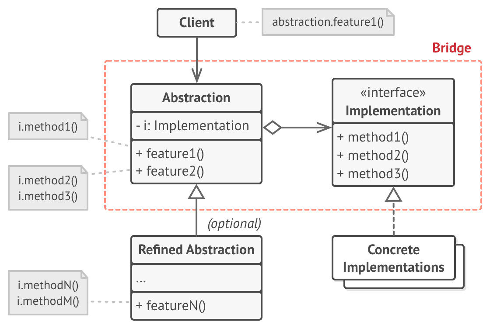
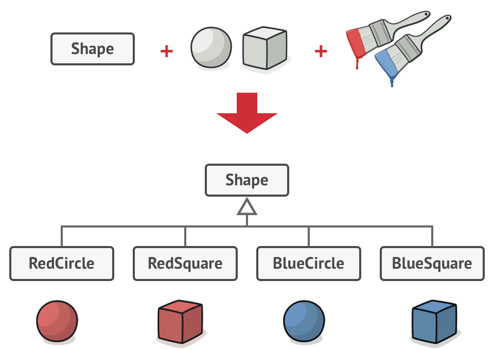
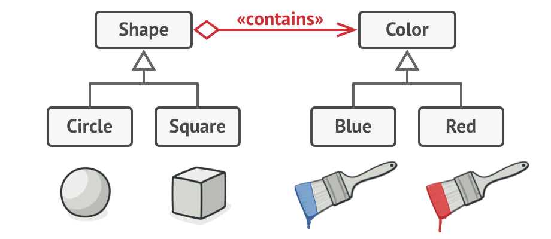

## Bridge Pattern
Bridge is a structural design pattern that lets you split a large class or a set of closely related classes into two 
separate hierarchies —`abstraction` and `implementation`— which can be developed independently of each other.

## Structure

## Problem
Say you have a geometric Shape class with a pair of subclasses: `Circle` and `Square`. 
You want to extend this class hierarchy to incorporate colors, so you plan to create `Red` and `Blue` shape subclasses. 
However, since you already have two subclasses, you’ll need to create four class combinations such as `BlueCircle` and 
`RedSquare`.

Adding new shape types and colors to the hierarchy will grow it exponentially. 
For example, to add a triangle shape you’d need to introduce two subclasses, one for each color. A
nd after that, adding a new color would require creating three subclasses, one for each shape type. 
The further we go, the worse it becomes.

## Solution
This problem occurs because we’re trying to extend the shape classes in two independent dimensions: `form` and `color`. 
That’s a very common issue with class inheritance.

The Bridge pattern attempts to solve this problem by switching from inheritance to the object composition. 
What this means is that you extract one of the dimensions into a separate class hierarchy, so that the original classes 
will reference an object of the new hierarchy, instead of having all of its state and behaviors within one class.

Following this approach, we can extract the color-related code into its own class with two subclasses: `Red` and `Blue`.
The `Shape` class then gets a reference field pointing to one of the color objects. Now the shape can delegate any 
color-related work to the linked color object. That reference will act as a bridge between the `Shape` and `Color` 
classes. From now on, adding new colors won’t require changing the shape hierarchy, and vice-versa.

## Participants
There are 2 parts in Bridge design pattern :

- `Abstraction`: core of the bridge design pattern and defines the crux. Contains a reference to the implementer.

- `Refined Abstraction`: Extends the abstraction takes the finer detail one level below. Hides the finer elements from
 implemetors.

- `Implementer`: It defines the interface for implementation classes. This interface does not need to correspond
 directly to the abstraction interface and can be very different. Abstraction imp provides an implementation in terms of operations provided by Implementer interface.

- `Concrete Implementation`: Implements the above implementer by providing concrete implementation.

## When to use this pattern
- When you want to divide and organize a monolithic class that has several variants of some functionality 
(for example, if the class can work with various database servers).
- When you need to extend a class in several orthogonal (independent) dimensions.
- If you need to be able to switch implementations at runtime. 

