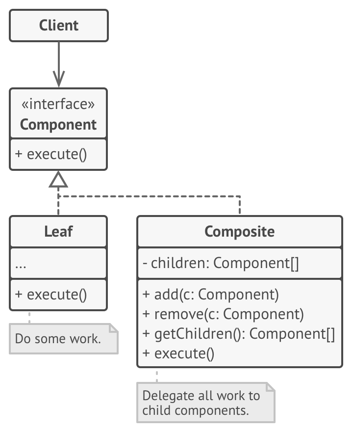
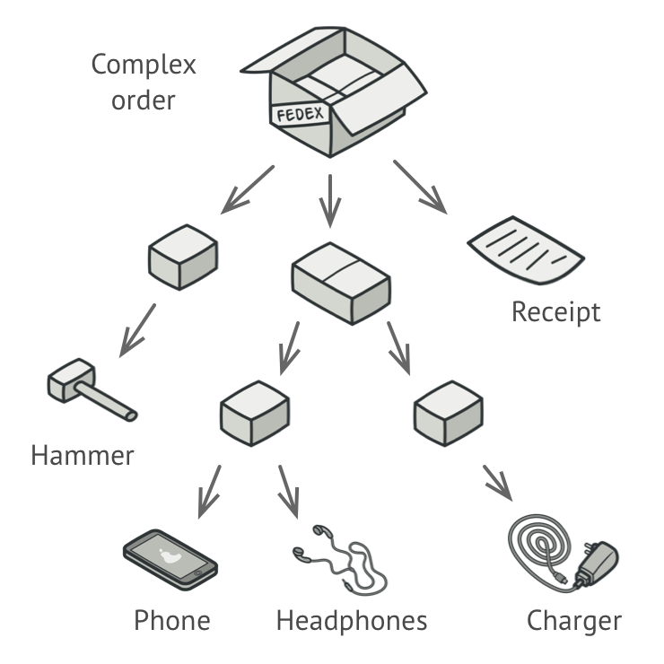
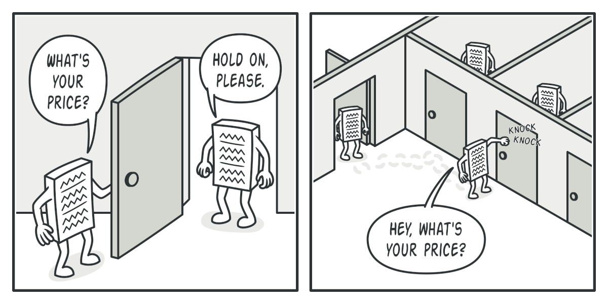

## Composite Pattern
Composite is a structural design pattern that lets you compose objects into tree structures and then work with these 
structures as if they were individual objects.

## Structure

## Problem
Using the Composite pattern makes sense only when the core model of your app can be represented as a tree.

For example, imagine that you have two types of objects: `Products` and `Boxes`. 
A `Box` can contain several `Products` as well as a number of smaller `Boxes`. 
These little `Boxes` can also hold some `Products` or even smaller `Boxes`, and so on.

Say you decide to create an ordering system that uses these classes. 
`Orders` could contain simple products without any wrapping, as well as boxes stuffed with products...and other boxes. 
How would you determine the total price of such an order?

You could try the direct approach: unwrap all the boxes, go over all the products and then calculate the total. 
That would be doable in the real world; but in a program, it’s not as simple as running a loop. 
You have to know the classes of `Products` and `Boxes` you’re going through, the nesting level of the boxes and other 
nasty details beforehand. All of this makes the direct approach either too awkward or even impossible.

## Solution
The Composite pattern suggests that you work with `Products` and `Boxes` through a common interface which declares a 
method for calculating the total price.

How would this method work? For a product, it’d simply return the product’s price. 
For a box, it’d go over each item the box contains, ask its price and then return a total for this box. 
If one of these items were a smaller box, that box would also start going over its contents and so on, until the prices 
of all inner components were calculated. 
A box could even add some extra cost to the final price, such as packaging cost.

The greatest benefit of this approach is that you don’t need to care about the concrete classes of objects that compose 
the tree. You don’t need to know whether an object is a simple product or a sophisticated box. You can treat them all 
the same via the common interface. When you call a method, the objects themselves pass the request down the tree.

## Participants
- `Component`: An abstract base class for the objects in the tree structure. This class defines the default behavior
 for all objects and behaviors to access and manage child components in the tree.

- `Leaf`: Is a class that extends Component to represent leaves in the tree structure that does not have any
 children.

- `Composite`: Is a class that extends Component to represent nodes (contain children) in the tree structure. This
 class stores Leaf components and implements the behaviors defined in Component to access and manage child components. 
 As mentioned earlier, child components can be one or more Leaf or other Composite components.

- `Client`: Interacts with Component to access and manipulate objects in the composition.

## When to use this pattern
- When you have to implement a tree-like object structure.
- When you want the client code to treat both simple and complex elements uniformly.

