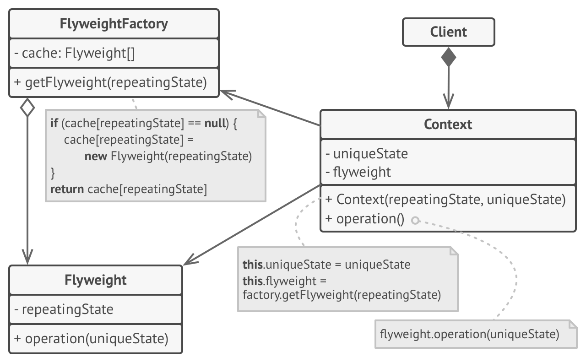
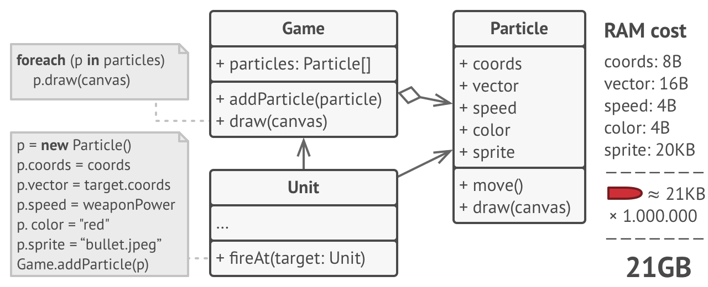
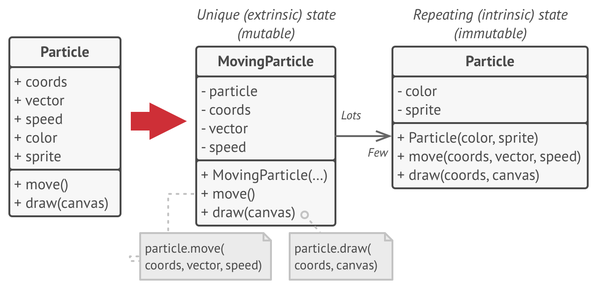
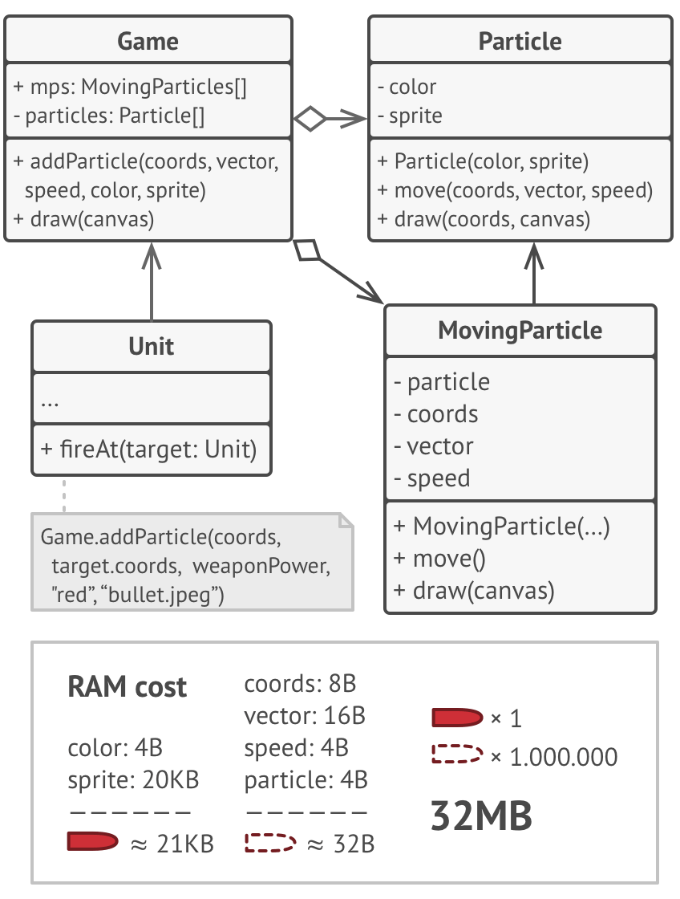

## Flyweight Pattern
Flyweight is a structural design pattern that lets you fit more objects into the available amount of RAM by sharing 
common parts of state between multiple objects instead of keeping all of the data in each object.
## Structure

## Problem
To have some fun after long working hours, you decided to create a simple video game: players would be moving around a 
map and shooting each other. You chose to implement a realistic particle system and make it a distinctive feature of the 
game. Vast quantities of bullets, missiles, and shrapnel from explosions should fly all over the map and deliver a 
thrilling experience to the player.

Upon its completion, you pushed the last commit, built the game and sent it to your friend for a test drive. 
Although the game was running flawlessly on your machine, your friend wasn’t able to play for long. 
On his computer, the game kept crashing after a few minutes of gameplay. After spending several hours digging through 
debug logs, you discovered that the game crashed because of an insufficient amount of RAM. 
It turned out that your friend’s rig was much less powerful than your own computer, and that’s why the problem emerged 
so quickly on his machine.

The actual problem was related to your particle system. 
Each particle, such as a bullet, a missile or a piece of shrapnel was represented by a separate object containing plenty 
of data. At some point, when the carnage on a player’s screen reached its climax, newly created particles no longer fit 
into the remaining RAM, so the program crashed.

## Solution
On closer inspection of the Particle class, you may notice that the color and sprite fields consume a lot more memory 
than other fields. What’s worse is that these two fields store almost identical data across all particles. 
For example, all bullets have the same color and sprite.

Other parts of a particle’s state, such as coordinates, movement vector and speed, are unique to each particle. 
After all, the values of these fields change over time. This data represents the always changing context in which the 
particle exists, while the color and sprite remain constant for each particle.

This constant data of an object is usually called the `intrinsic state`. 
It lives within the object; other objects can only read it, not change it. 
The rest of the object’s state, often altered “from the outside” by other objects, is called the `extrinsic state`.

The Flyweight pattern suggests that you stop storing the `extrinsic state` inside the object. 
Instead, you should pass this state to specific methods which rely on it. 
Only the `intrinsic state` stays within the object, letting you reuse it in different contexts. 
As a result, you’d need fewer of these objects since they only differ in the intrinsic state, which has much fewer 
variations than the extrinsic.

Let’s return to our game. Assuming that we had extracted the extrinsic state from our particle class, only three 
different objects would suffice to represent all particles in the game: a bullet, a missile, and a piece of shrapnel. 
As you’ve probably guessed by now, an object that only stores the intrinsic state is called a flyweight.

## Participants
- `Flyweight`: Abstract class or interface for flyweight objects. Declares method through which flyweights can
 receive and act on extrinsic state. Although Flyweight enables sharing, it is not mandatory that all Flyweight 
 subclasses must be shared.

- `ConcreteFlyweight`: Extends/Implements Flyweight to represent flyweight objects that can be shared.

- `FlyweightFactory`: Creates and manages flyweight objects. When a client requests a flyweight object, 
`FlyweightFactory` provides an existing one or creates a new one, if it does not exists.

- `Client`: Requests `FlyweightFactory` for a flyweight object, and then computes and passes the extrinsic data to it.

## When to use this pattern
- Use the Flyweight pattern only when your program must support a huge number of objects which barely fit into available RAM.
  
  The benefit of applying the pattern depends heavily on how and where it’s used. It’s most useful when:
  
  - an application needs to spawn a huge number of similar objects
  - this drains all available RAM on a target device
  - the objects contain duplicate states which can be extracted and shared between multiple objects

