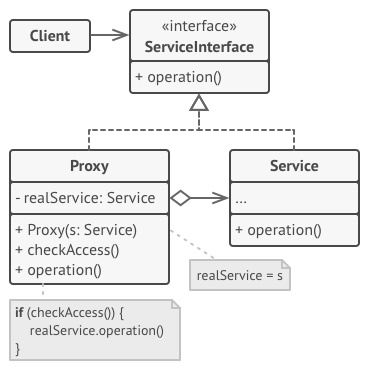

## Proxy Pattern
Proxy is a structural design pattern that lets you provide a substitute or placeholder for another object. 
A proxy controls access to the original object, allowing you to perform something either before or after the request 
gets through to the original object.

## Structure

## Problem
Why would you want to control access to an object? Here is an example: you have a massive object that consumes a vast 
amount of system resources. You need it from time to time, but not always.

You could implement lazy initialization: create this object only when it’s actually needed. 
All of the object’s clients would need to execute some deferred initialization code. 
Unfortunately, this would probably cause a lot of code duplication.

In an ideal world, we’d want to put this code directly into our object’s class, but that isn’t always possible. 
For instance, the class may be part of a closed 3rd-party library.

## Solution
The Proxy pattern suggests that you create a new proxy class with the same interface as an original service object. 
Then you update your app so that it passes the proxy object to all of the original object’s clients. 
Upon receiving a request from a client, the proxy creates a real service object and delegates all the work to it.

But what’s the benefit? 
If you need to execute something either before or after the primary logic of the class, the proxy lets you do this 
without changing that class. Since the proxy implements the same interface as the original class, it can be passed to 
any client that expects a real service object.

## Participants
- `Subject`: Is an interface for both the real object and its proxy. The Subject enables the proxy to be used
 anywhere the real object is expected.

- `RealSubject`: The real object that is expensive to create, requires protection, or running on a remote JVM. 
RealSubject implements Subject and we create proxy of it.

- `Proxy`: Implements Subject and maintains a reference to RealSubject.

## When to use this pattern
- `Lazy initialization (virtual proxy)`. 
This is when you have a heavyweight service object that wastes system resources  by being always up, even though you
only need it from time to time.

    Instead of creating the object when the app launches, you can delay the object’s initialization to a time when it’s 
    really needed.

- `Access control (protection proxy)`. 
This is when you want only specific clients to be able to use the service object;  for instance, when your objects
 are crucial parts of an operating system and clients are various launched applications (including malicious ones).
  
  The proxy can pass the request to the service object only if the client’s credentials match some criteria.

- `Local execution of a remote service (remote proxy)`. 
This is when the service object is located on a remote server.

    In this case, the proxy passes the client request over the network, handling all of the nasty details of working 
    with the network.
   
- `Logging requests (logging proxy)`. 
This is when you want to keep a history of requests to the service object.

    The proxy can log each request before passing it to the service.
    
- `Caching request results (caching proxy)`. 
This is when you need to cache results of client requests and manage the  life cycle of this cache, especially if
 results are quite large.

    The proxy can implement caching for recurring requests that always yield the same results. The proxy may use the 
    parameters of requests as the cache keys.

- `Smart reference`. 
This is when you need to be able to dismiss a heavyweight object once there are no clients that use it.
  
  The proxy can keep track of clients that obtained a reference to the service object or its results. From time to time, the proxy may go over the clients and check whether they are still active. If the client list gets empty, the proxy might dismiss the service object and free the underlying system resources.
  
  The proxy can also track whether the client had modified the service object. Then the unchanged objects may be reused by other clients.
